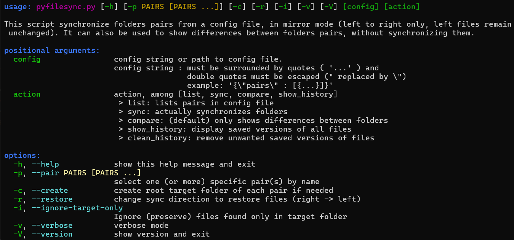

# pyfilesync
### A python 3 script that synchronizes multiple folder pairs and keep copies of modified files.


<p align="middle">
    
</p>

##

# Main features
- tested on both Linux and Windows
- mode of operation : one-way mirroring (left to right folder)
- folders and sync parameters read from a json file or string
- 'Compare' command : finds and prints differences between left and right folders without doing actual synchronization
- 'sync' command for actual synchronization
- 'list' command : prints all folder pairs from config file
- 'restore' option to copy back files from right to left
- History mode : save copies of modified files (activable from config file)
- option allowing to process a subset of folder pairs from config file
- comparison criteria : file size and modification date (or file size and file content if requested)
- case sensitivity of filesystem is detected to interpret include/exclude pattern correctly


# Command line
Use the following command line to show usage :
```sh
python pyfilesync -h
```
The message shown is as follow :
<p align="left">
    
</p>

### Compare command
The compare command finds all differences between left and right folders of each folder pair defined in config file. It prints out the result as a summary. Use the `--verbose` option to see all files that are only left, only right and different.

### sync command
The sync command do the actual files synchronization, creating directories and copying files.

### restore option
Use `restore` option with `compare` or `sync` command to reverse synchonization direction : the files in the right folder will be compared/sync with left folder.<br>
The default behaviour is a "clean restore" : Be aware that left only files (i.e. files that were filtered during copy operation, and that are NOT present in right folder) will be removed.<br>
**To preserve left only files, use the `--ignore-target-only` option**

### show_history command
The `show_history` command prints out all synced files that have some versions saved in history

### clean_history command
The `clean_history` command seeks for versions of files that should not be kept in history, and remove them.
This is usefull after history mode parameters have been changed in config file (ex: `depth` parameter decreased), or to clean versions of files removed in right folder.

# Config file format
A config file is a JSON file containing folder pairs to synchronize.

> **Environment variables can be used in any field that receives a path or a pattern, using either `$varname` or `${varname}` format.**

A minimal example with 1 folder pair is shown below :
```json
{
    "pairs": [
        {
            "left": "$HOME",
            "right": "/mnt/mysavedisk/rightfolder1"
        }
    ]
}
```

An optional `global` section sets parameters that applies to all pairs :
- all parameters in `global` are optional
- include/exclude/include_regex/exclude_regex lists in global are appended to include/exclude in each pair
- All other parameters can be redefined in any pair

```json
{
    "global": {
        "include": ["*.txt", "*.mp4"],
        "exclude": ["temp", "*.bak", "*.tmp"],
        "include_regex": [".*/somedir/.*\\.bat"],
        "exclude_regex": [".*test"],
        "history_mode": {
            "depth": 10,
            "file_max_saved_size": "20 Mb"
        }
    },
    "pairs": [
        {
            "name": "Personal_Data",
            "left": "~/personalfolder/",
            "right": "/mnt/mysavedisk/rightfolder1",
            "include": ["*/subDir3/*.py"],
            "cmp_files_content": true,
        },
        {
            "name": "Bookmarks",
            "left": "/mnt/data/internet/",
            "right": "${TARGETDIR}"
        }
    ]
}
```

All available parameters are presented here after :
Field name        | default<br>value | global<br>section | env vars<br>(*) | Description
---:              | :---:       | :---: |:---: | :---
`left`            |             | no  | yes | **-> mandatory**<br>left (source) folder to synchronize from.
`right`           |             | no  | yes | **-> mandatory**<br>right (target) folder to synchronize to.
`name`            |             | no  | no  | name of the pair. only `_`, `-` and alphanumeric characters are allowed.<br>if not set, a name is automatically generated.
`include`         | **[ '*' ]** | yes | yes | list of **wildcard** expressions that filter the left files to synchronize.
`exclude`         |  **[ ]**    | yes | yes | list of **wildcard** expressions that filter out paths to synchronize.<br>the exclude filters are prioritary over include filters.
`include_regex`   |   **[ ]**   | yes | yes | list of **regular expressions** that filter the left files to synchronize.<br>note: `include_regex` list is appended to `include`, if any.
`exclude_regex`     | **[ ]**   | yes | yes | list of **regular expressions** that filter out paths to synchronize.<br>the exclude filters are prioritary over include filters.<br>note: `include` list is appended to `exclude`, if any.
`cmp_files_content` | **false** | yes | no  | boolean field to force files content instead of modification times as comparison criteria<br>example: ```"cmp_files_content": true```
`history_mode.depth` | 0        | yes | no  | if >0, history mode is enabled. All files are saved in `.autosave` folder. `depth` is the number of update saved for each file.
`history_mode.file_max_saved_size` | 0        | yes | no  | Maximum total bytes of data saved for each file (0 means no limit). For example, if each saved version of a file has a size of 3Mb and `file_max_saved_size` is 6Mb, then 2 versions of this file will be saved.<br>The value may be an integer or a string containing value followed by a unit (K, Kb, M, ...).<br>Examples: "100Kb", "100 M", "100G", "100 Gb"
> **(*) : If 'yes', use `$varname` or `${varname}` to reference an environment variable.**

### About include/exclude patterns
- Config file may contain optional include and/or exclude patterns.
- All files are included by default.
- The priority is given to exclude patterns over includes, in this order :
    - exclude patterns in global section
    - exclude patterns in current pair parameters
    - include patterns in global section
    - include patterns in current pair parameters
- The resulting file filter is used to detect missing files in right folder (left-only files), as well as files to remove (right-only files)
- Each pattern is tested on file path AND filename alone
- **Folder separator** : Always use `/` separator in wildcards and regex expressions, for `\` is replaced by `/` automatically in all file paths before trying to match patterns, so that it will give the same results under Windows and Linux.
- **case sensitivity** : include and exclude are case sensitive or case insensitive depending on left folder filesystem (auto-detected for each pair)
- Be aware that file paths are all made relative to the left/right folders (left/right folders part of any file path is removed before regex matching)
- 2 options are given to indicate include/exclude patterns (NOT mutually exclusive) :
  - Regex expressions : use `"include_regex"` and/or `"exclude_regex"` fields
  - Extended wildcard expressions : use "include" and/or "exclude" fields.

#### Examples of wildcard expressions
Expression        | Description
:---              | :--- |
`'*.cpp'`         | matches path for files (not dir) that have a `.cpp` filename extension
`'book_num??.txt'`| matches paths for files (not dir) like `'book_num03.txt'` or `'book_num29.txt'`
`'*/subDir1/*'`<BR>`'*/subDir1/'` | matches any path that contains a directory named `subDir` anywhere |
`'/rootDir/*'`<BR>`'/rootDir/'`   | matches only paths that start with `rootDir` directory |
`'*/subDir/*.py'`   | matches paths that contain a dir named  `subDir` and whose filename ends with `.py`
`'/subDir1/subDir2/myfile.py'` | matches exact file path (from 'pair' base folder)
`'/subDir1/subDir2/'` | matches exact directory path (from 'pair' base folder), and its content
`'*/subDir2/myfile.py'` | matches partial file path


Example including mp4 and txt files but excluding files in any 'temp' subdir :
```json
{
    "pairs": [
        {
            "left": "~/foldertosave1/",
            "right": "/mnt/mysavedisk/rightfolder1",
            "include": ["*.txt", "*.mp4"],
            "exclude": ["*/temp/"]
        }
    ]
}
```

